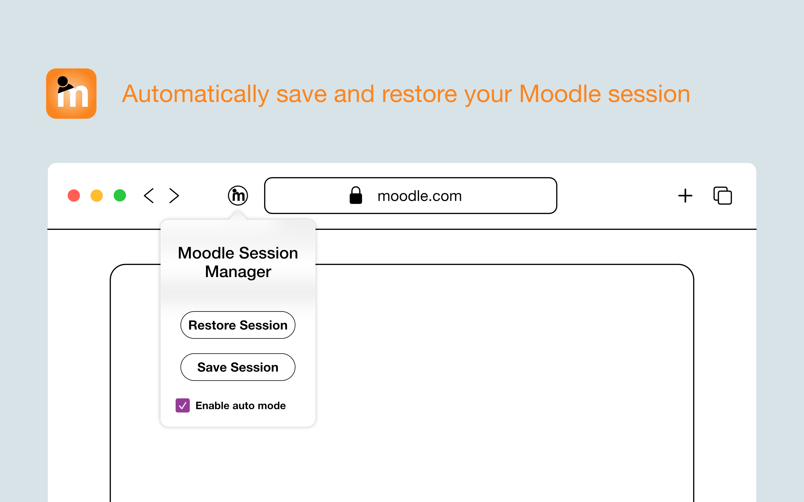

# Moodle Session Manager for Safari (Apple)

Moodle has the problem that it stores the login only in the session which is deleted when closing Safari.

This tool lets you save the **MoodleSession** cookie and restore it if you open moodle again.

<h1 align="center">
  Moodle Session Manager - Safari Extension
  
</h1>

<h4 align="center">Stay logged in!</h4>

  <a href="#key-features">Key Features</a> •
  <a href="https://apps.apple.com/ch/app/moodle-session-manager/id6736646327?mt=12">Download</a> •
  <a href="#installation">How To Use</a> •
  <a href="#license">License</a> •
  <a href="#contact">Contact</a>

TillTotal is an iOS app developed in Xcode that simplifies cash counting and tracking for store owners and individuals. With TillTotal, you can conveniently enter the amount of individual coins or input the total amount, providing flexibility for different counting methods. This feature proves particularly useful when counting banknotes individually but calculating the total value of coins.

## Key Features

- Automatically saves and restores your Moodle session (cookie-based).
- Manual or automatic mode with one-click operation.
- Local-only session handling — no remote servers or data syncing.
- Compatible with most Moodle instances.
- Supports dark mode.
- Small and privacy-friendly.

## Installation

### Through the App Store
Download TillTotal from the [App Store](https://apps.apple.com/ch/app/moodle-session-manager/id6736646327?mt=12).

### Using Xcode
1. Clone or download this repository to your local machine.
2. Open the project in Xcode.
3. Build and run the app on your device.

## Usage

1. Navigate to your Moodle login page in Safari.
2. Click the extension icon in the Safari toolbar.
3. Use the Save and Restore buttons to manage your session.
4. Optionally enable Auto Mode to restore your session automatically when visiting Moodle again.

## Contributing

Contributions to Moodle Session Manager are welcome! If you find any bugs, have suggestions for new features, or would like to contribute in any way, please open an issue or submit a pull request.

## License

This project is licensed under the [MIT License](LICENSE).

## Contact

For any inquiries or questions, please reach out to me at [info@samkry.ch](mailto:info@samkry.ch)
